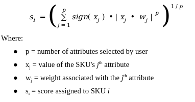
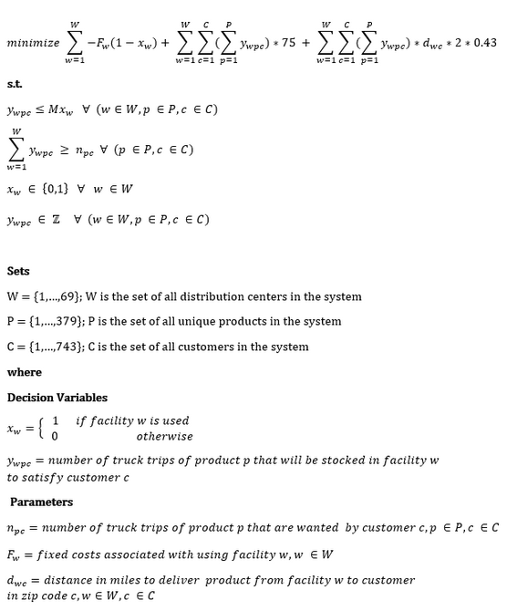

# senior-design

This repo contains Georgia Tech's Spring 2020 Industrial Engineering Senior Design Team 17's final client deliverables.

All materials herein (and in the intermediate versions) are in accordance with the project's NDA.

##### Team members: 
Jessica Buzzelli,
Nataly Granados,
Dan Kim,
Sean Ko,
Iris Liu,
Armando Marimon,
Diego Fernandez Padron,
and Emily Young

##### Faculty Advisor: 
Dr. Leon McGinnis

### Phase I
The client has a large array of products and specializes through customization. As such, it has amassed a product catalog
where a small percentage of items comprise an overwhelming majority of sales volume and overall profit. 

The Phase I model has separate modes to determine (1) which products are best performing ("core" items), and (2) which products are most 
safe to discontinue. The GUI intakes decision metrics given by the user (and their relative importance) and 
calls ```vectorize.py``` to calculate a single score for each product on a warehouse-by-warehouse basis to rank and 
classify the catalog. 

The score is modeled after a p-dimensonal vector norm and is calcuated as follows:


We suggest use of correlation analysis before choosing decision metrics for the model in order to uphold an independence assumption implied by the formulation.

### Phase II
Since the client has grown primarily through acquisition, it has inherited a decentralized warehousing network with 
many warehouses expected to be redundant. Phase II addresses the problems of (1) where to store items believed to be at the
core of the client's business and (2) which warehouses pose the least elimination risk. 

In regards to the warehouses' fixed costs, historical sales (assumed to be equal to "demand"), and tranportation cost estimates,
 the model determines the optimal location of all "core" products by looping one by one through (a mixed integer linear
 program).
  
The optimization model follows the following formulation:

 
