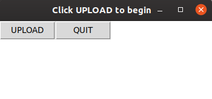
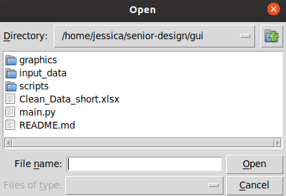
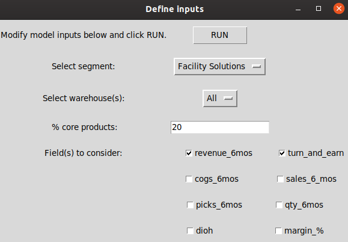

### Dependencies:
1. pandas
1. tkinter
1. sklearn

Will package with pyinstaller or similar to enforce/package dependencies. 

### UI:
##### Upload Screen:

##### File uploader:

##### Inputs screen:

- Can adapt input type / aesthetics as needed since still refining the model to work with new inputs.

