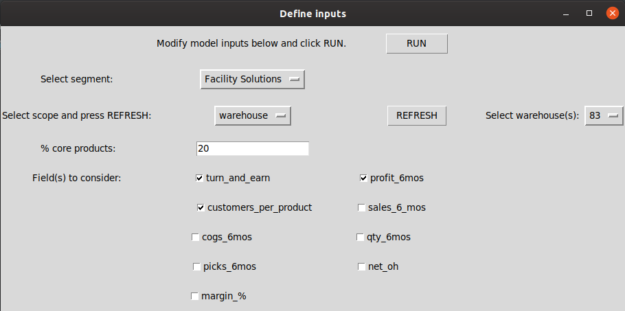
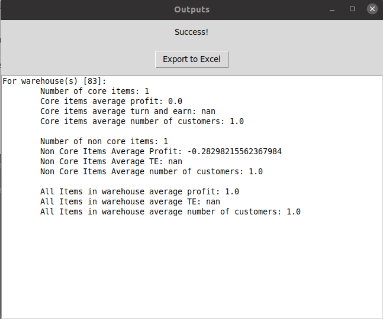

### Dependencies:
1. pandas
1. numpy
1. tkinter

Will package with pyinstaller or similar to enforce dependencies. 

### UI:
##### Upload Screen:

##### File uploader:

##### Inputs screen:

##### Loading screen:

##### Outputs screen:

- Can adapt input type / aesthetics as needed since still refining the model to work with new inputs.

