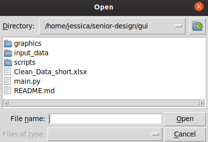
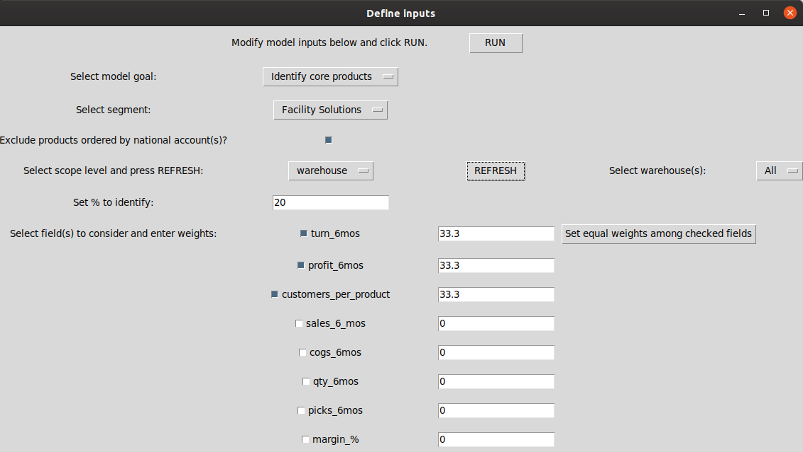
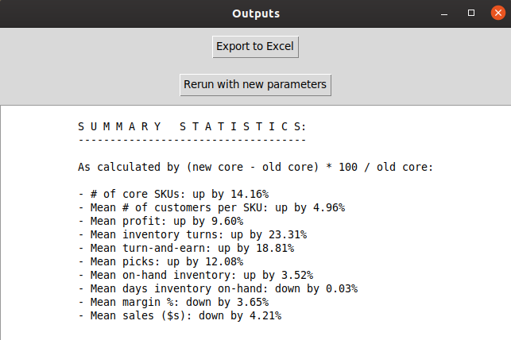
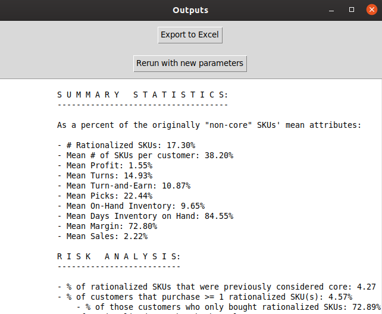

### Dependencies:
1. ```python 3 ```
1. ```pandas 0.25.3```
1. ```numpy 1.18.1```
1. ```tkinter 0.1.0```

### Input file spec requirements:
- Training data contained in: (1) an Excel notebook's ```Sheet 1``` or (2) a CSV with headers
- Rows will represent a unique (```legacy_customer_cd```, ```legacy_division_cd```, ```legacy_product_cd```) combinations.
- Columns will represent attribute fields and will include:
   - ```cogs 6mos```
   - ```core item flag```
   - ```segment```
   - ```national acct flag```
   - ```sales channel```
   - ```qty 6mos```
   - ```sales 6 mos``` (note inconsistent naming convention)
   - ```picks 6mos```
   - ```net OH $```
   - ```item poi days```
   - ```dioh```

### UI:
##### 1. Upload Screen:


##### 2. File uploader:


##### 3. Inputs screen:


##### 4. Loading screen:


##### 5. Outputs screen:
If identifying core products:



If identifying products to eliminate:



